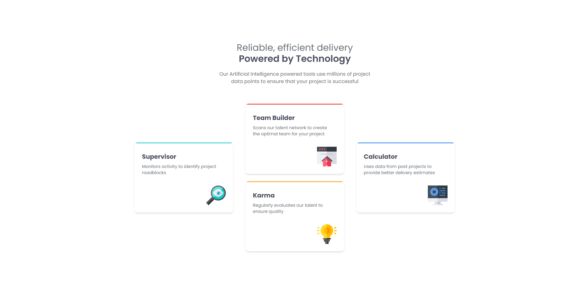
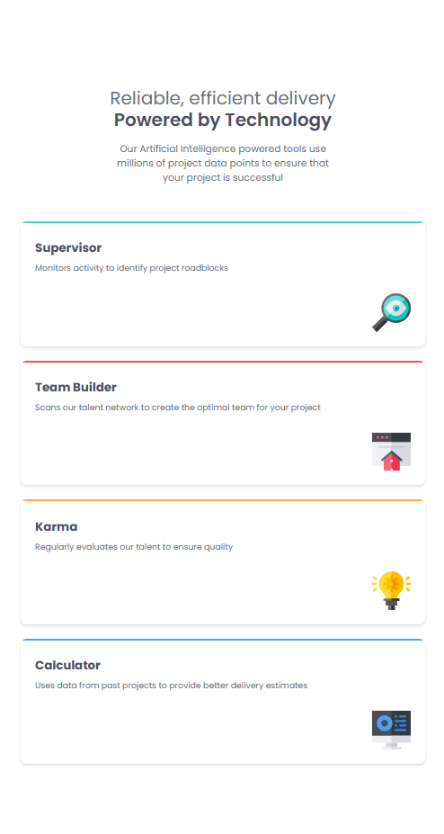

# Four Card Feature Section

## A responsive feature layout emphasizing structure and visual hierarchy

This project implements a four-card feature section designed to present key product or service features in a clear and visually balanced layout.
The section uses a combination of grid and flex layouts to create emphasis on the center content while maintaining symmetry on larger screens.

The focus of this project is layout composition, responsive behavior, and reusable component structure, ensuring the section remains readable and visually engaging across different viewport sizes.

### Screenshots

#### Image of the Desktop Design

#### Image of the Mobile Design

### Layout & Implementation Explanation
The overall layout is controlled using a responsive grid configuration:

grid-rows-1 lg:grid-cols-[1fr_1.25fr_1fr]

### Card Rendering Logic (Array-Based Layout)

The cards are stored in an array of objects, and specific items from the array are used to construct the layout. Instead of rendering all cards in a flat list, they are intentionally grouped to control alignment and spacing.

The layout is implemented as follows:

  <Card {...card[0]} />

  <Card {...card[1]} />
  <Card {...card[2]} />

  <Card {...card[3]} />

</section>

### Built with

- [React](https://react.dev/) - JS library
- [TypeScript](https://www.typescriptlang.org/) - type superset of JS
- [Tailwindcss](https://tailwindcss.com/) - utility-first CSS framework

## Author

- Website - [Mihailo Djurovic](portfolio-miahilo.vercel.app)
